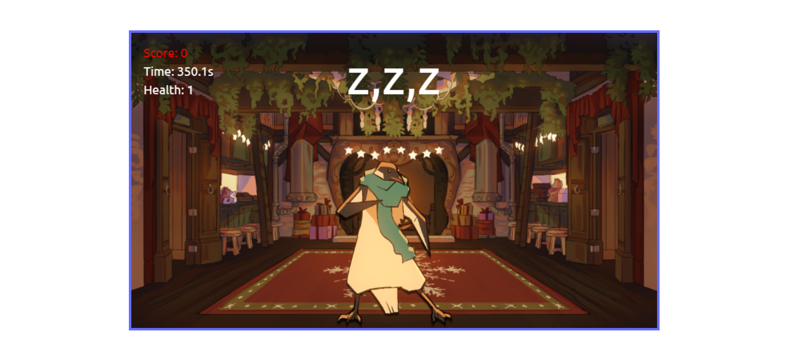

<!-- {
    "team": "",
    "creators": "Axel Jakobsson",
    "title": "Dead moves",
    "description": "Beskriv ditt spel i en slående mening. Varför ska vi spela ditt spel?",
    "image": "",
    
    "url": "[https till ditt färdiga spel](https://axeljakobsson.github.io/dead-moves/)",
    "git": "https till ditt git repo med spelet"
}, -->

# Spelets Information

## Team
**Gruppnamn:** Dead moves gruppen  

## Skapare
**Vilka är ni som skapat spelet?**  
Axel Jakobsson

## Titel  
**Spelets titel:** *Dead moves*  

## Beskrivning  
*Kill penguins in this exhilarating game!*  

## Länk till spelet  
[Spela spelet här](https://axeljakobsson.github.io/dead-moves/)  

## GitHub Repository  
[Källkod på GitHub](https://github.com/AxelJakobsson/dead-moves)  
